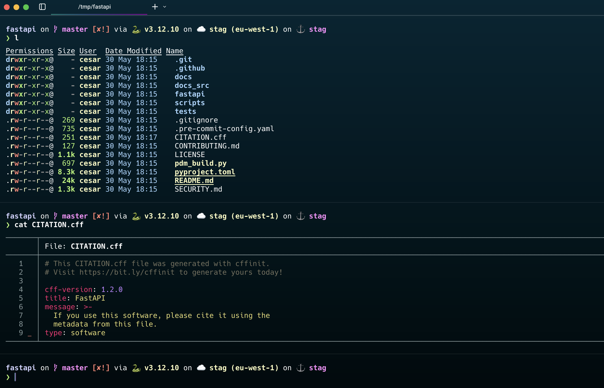

# Dotfiles

My personal config for a zen and productive workflow



## Stack

- **Browser**: [Zen Browser](https://zen-browser.app/)
- **IDE**: [Cursor](https://cursor.sh)
- **Terminal**: [Warp](https://warp.dev)
- **Shell**: [Starship](https://starship.rs/)

## Required packages (partially covered in `.init.sh`)

- git
- zsh
- [starship](https://starship.rs/) (faster & fancier `oh-my-zsh`)
- [eza](https://github.com/eza-community/eza) (better `ls`)
- [bat](https://github.com/sharkdp/bat) (better `cat`)
- [zoxide](https://github.com/ajeetdsouza/zoxide) (better `cd`)
- [uv](https://github.com/astral-sh/uv) (faster `pip`)
- [github cli](https://cli.github.com/)
- [git zsh plugin](https://github.com/ohmyzsh/ohmyzsh/blob/master/plugins/git/README.md) (useful `git` aliases)
- [git-brunch](https://github.com/andys8/git-brunch) (interactive git branch selection)
- [aws cli](https://docs.aws.amazon.com/cli/latest/userguide/getting-started-install.html)
- [aws zsh plugin](https://github.com/ohmyzsh/ohmyzsh/blob/master/plugins/aws/README.md) (useful `asp` command)

## Installation

1. Clone this repository:
   ```
   git clone https://github.com/cclaude42/dotfiles.git ~/.dotfiles
   ```

2. Manually install required packages, setup the apps and copy the dotfiles where they need to go.

Alternatively, run the initialization script (experimental) :
   ```
   cd ~/.dotfiles
   bash .init.sh
   ```


## Configuration Files

- `.zshrc` → `~/.zshrc`
- `starship.toml` → `~/.config/starship.toml`
- `.gitconfig` → `~/.gitconfig`
- `.gitconfig-subconfig` → `~/.gitconfig-subconfig`
- `aws-config` → `~/.aws/config~`
- `cursor-settings.json` → Cursor settings location (depends on OS)
